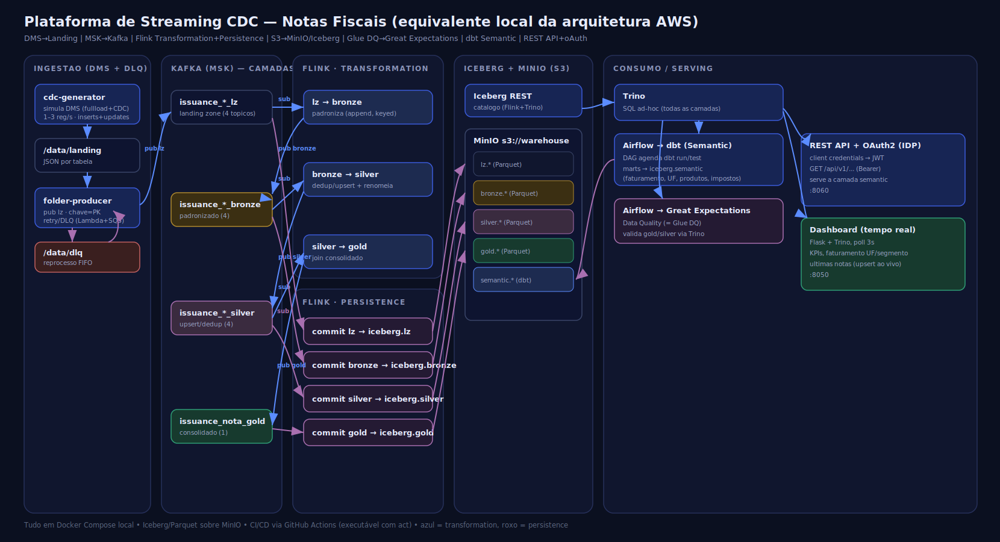

# 🛰️ Plataforma de Streaming CDC — Lakehouse em Tempo Real

> **Pipeline de dados end-to-end, 100% local:** CDC simulado → **Kafka** → **Flink** (medallion) → **Iceberg/Parquet** → **Trino** + **dbt** + **Airflow**, com **dashboard em tempo real** e **REST API**.
>
> *End-to-end, fully-local streaming data platform — the local equivalent of an AWS lakehouse (DMS → MSK → Flink → S3/Iceberg → Glue DQ → REST API).*

[](https://github.com/douglasmsf/streamming/actions/workflows/ci.yml)
[](https://github.com/douglasmsf/streamming/releases)
[](LICENSE)


---

## 🗺️ Arquitetura



```
INGESTÃO (DMS-like + DLQ)        KAFKA (MSK) por camada        FLINK SQL
cdc-generator → /data/landing    issuance_*_lz                 Transformation:
   → folder-producer (DLQ) ───►  issuance_*_bronze   ◄═══════   lz→bronze→silver→gold
                                 issuance_*_silver             Persistence:
                                 issuance_nota_gold  ═══════►    cada tópico → Iceberg

ICEBERG (lz/bronze/silver/gold/semantic) sobre MinIO (S3)
   → Trino (SQL) → dbt (camada semantic) + Great Expectations (Data Quality)
   → REST API (OAuth2/JWT) + Dashboard/Console em tempo real (lê do Kafka)
```

## ⭐ Destaques

- 🔄 **CDC em tempo real** — 1–3 eventos/seg misturando *inserts* e **alterações de registros já enviados** (mesma PK, `op="U"`).
- 🧱 **Medallion no Flink SQL** — *Transformation* (lz→bronze→silver→gold **entre tópicos Kafka**) e *Persistence* (cada tópico → **Iceberg/Parquet**), espelhando uma arquitetura AWS real.
- 🧊 **Apache Iceberg (upsert)** — `format-version 2` + *equality deletes*: a silver/gold convergem para o estado atual a cada alteração (dedup por chave).
- 📊 **Dashboard em tempo real** — consome o **Kafka diretamente** (estado em memória, atualiza a cada mensagem); KPIs, gráficos por UF/segmento e últimas notas ao vivo.
- 🧪 **Data Quality** com Great Expectations e **camada semantic** com dbt (orquestrados pelo Airflow).
- 🔌 **REST API** com OAuth2 (client credentials → JWT) servindo a camada analítica.
- 🛠️ **Resiliência** — producer com **DLQ/retry** (simula Lambda+SQS FIFO), catálogo Iceberg em Postgres, manutenção automática (`OPTIMIZE`/`expire_snapshots`).
- ⚙️ **CI/CD** com GitHub Actions (lint, testes, build, release por tag) — executável offline com `act`.

## 🧰 Stack

| Camada | Tecnologia |
|--------|-----------|
| Geração de CDC | Python (gerador + producer pasta→Kafka, com DLQ) |
| Mensageria | Apache Kafka (KRaft) — tópicos por camada |
| Processamento streaming | Apache Flink (SQL) |
| Tabelas / storage | Apache Iceberg + Parquet sobre MinIO (S3) |
| Catálogo | Iceberg REST (backend Postgres) |
| Consulta (batch/ad-hoc) | Trino |
| Analytics / Semantic | dbt (dbt-trino) |
| Data Quality | Great Expectations |
| Orquestração | Apache Airflow |
| Serving | REST API (Flask) + OAuth2/JWT |
| Observabilidade | Dashboard/Console em tempo real (Flask + Kafka) |
| CI/CD | GitHub Actions (executável com `act`) |

## 🚀 Como rodar

> Pré-requisito: **Docker Desktop** com **VM ≥ 10 GB** (ver [`docs/runbook.md`](docs/runbook.md)).

```powershell
# Windows (PowerShell)
./scripts/run.ps1 up        # builda e sobe toda a infraestrutura
./scripts/run.ps1 jobs      # submete os jobs Flink (transform + persist)
```

```bash
# Linux / macOS / WSL
make up
make jobs
```

Depois abra o **Console em tempo real** 👉 **http://localhost:8050**

## 🖥️ Interfaces

| UI | URL | Credenciais |
|----|-----|-------------|
| **Console (tempo real)** | **http://localhost:8050** | — |
| REST API (serving) | http://localhost:8060 | client `potencial` / `secret` |
| Flink | http://localhost:8081 | — |
| Trino | http://localhost:8080 | — |
| Airflow | http://localhost:8082 | admin / admin |
| Kafka UI | http://localhost:8088 | — |
| MinIO | http://localhost:9001 | admin / password |

> 📋 Guia completo de acessos (URLs, endpoints, credenciais e exemplos) em
> [`docs/acessos.md`](docs/acessos.md).

## 💡 O que este projeto demonstra

- **Engenharia de dados em streaming**: CDC, mensageria, *stream processing* declarativo (Flink SQL).
- **Lakehouse / Iceberg**: medallion, *upsert*/dedup por chave, *time travel*, compactação e *snapshot expiry*.
- **Modelagem & Analytics**: camada semantic com dbt, testes e contratos de dados.
- **Confiabilidade**: DLQ/retry, Data Quality automatizado, manutenção de tabelas.
- **Plataforma**: orquestração (Airflow), serving com autenticação, observabilidade em tempo real.
- **Engenharia de software**: IaC com Docker Compose, testes, lint e CI/CD.
- **Tradução cloud→local**: mapeamento fiel de uma arquitetura **AWS** (DMS, MSK, Glue DQ, S3) para componentes open-source locais.

## 🗂️ Estrutura

```
.
├── docker-compose.yml         # toda a plataforma (14 serviços)
├── generator/                 # gerador de eventos CDC -> /data/landing
├── producer/                  # pasta -> Kafka (com DLQ/retry)
├── flink/                     # Dockerfile (jars) + sql/ (transform.sql, persist.sql)
├── trino/                     # config + catálogo Iceberg + queries de exemplo
├── dbt/                       # projeto dbt (camada semantic) sobre Trino
├── dq/                        # Great Expectations + manutenção Iceberg
├── airflow/                   # imagem + DAGs (dbt, DQ, manutenção)
├── serving/                   # REST API (Flask) + OAuth2
├── dashboard/                 # console em tempo real (Flask + Kafka)
├── scripts/run.ps1            # atalhos (Windows)
├── tests/                     # testes unitários (gerador/producer)
├── docs/                      # arquitetura (+SVG), modelo de dados, CDC/upsert, runbook
└── .github/workflows/         # CI (lint/test/build) + CD (release por tag)
```

## 📚 Documentação

- [🗺️ Arquitetura e diagrama](docs/arquitetura.md)
- [🧬 Modelo de dados](docs/modelo-dados.md)
- [🔄 CDC, updates e upsert](docs/cdc-e-upsert.md)
- [⚙️ Runbook (operação e troubleshooting)](docs/runbook.md)
- [🔑 Guia de acessos (URLs, credenciais e exemplos)](docs/acessos.md)

## 🧪 Desenvolvimento

```bash
pip install ruff pytest -r generator/requirements.txt -r producer/requirements.txt
ruff check .
pytest
```

## 📄 Licença

[MIT](LICENSE) — sinta-se à vontade para usar, estudar e adaptar.
