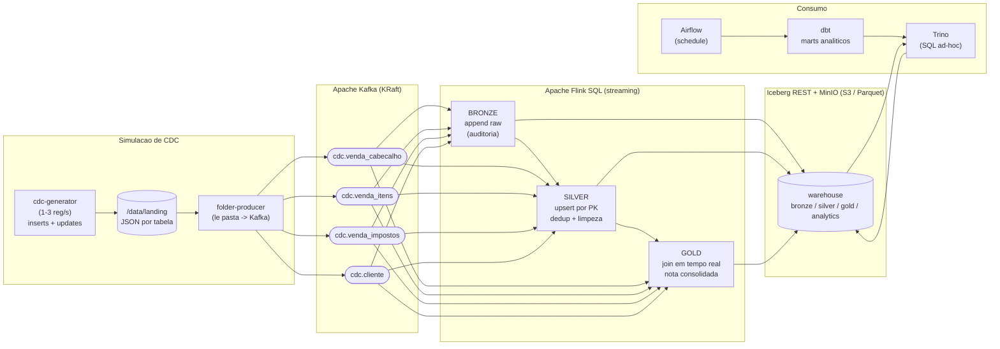

# Arquitetura

Plataforma local de dados em **streaming** que simula um CDC (Change Data
Capture) de um Postgres de notas fiscais, processa em camadas **medallion**
(bronze → silver → gold) com **Apache Flink**, persiste em **Apache Iceberg /
Parquet** sobre **MinIO (S3)**, disponibiliza consulta via **Trino** e gera a
camada analítica com **dbt** orquestrado pelo **Airflow**.

## Desenho técnico

> Abra [`arquitetura.svg`](./arquitetura.svg) no navegador para a versão visual.

## Visão geral

## Fluxo de dados

1. **Simulação de CDC** — `cdc-generator` gera de 1 a 3 registros por segundo,
   misturando **inserts** (vendas novas) e **updates** (alterações de registros
   já enviados, com a mesma PK e `op="U"`). Cada evento é um arquivo JSON
   gravado em `./data/landing/<tabela>/`, simulando o Postgres derramando
   mudanças em tempo real.
2. **Ingestão para Kafka** — `folder-producer` observa a pasta, lê os arquivos
   em ordem de LSN e publica em **um tópico por evento**, usando a **chave
   primária como chave da mensagem** (essencial para o upsert).
3. **Bronze (Flink)** — consome os tópicos como *append* e grava o histórico
   bruto em tabelas Iceberg (auditoria: todo insert/update vira uma linha).
4. **Silver (Flink)** — consome via `upsert-kafka` (changelog por PK), o que
   **deduplica** mantendo a última versão de cada registro, renomeia colunas,
   tipa (DECIMAL) e deriva campos. Grava em Iceberg no modo **upsert**.
5. **Gold (Flink)** — junta, em streaming, cabeçalho + agregados de itens +
   agregados de impostos + cliente, gerando **uma linha consolidada por nota**.
   Qualquer alteração a montante recalcula a nota (upsert).
6. **Consulta (Trino)** — SQL ad-hoc sobre qualquer camada.
7. **Analytics (Airflow + dbt)** — o Airflow agenda o dbt, que roda sobre o
   Trino e materializa os **marts** analíticos no schema `iceberg.analytics`.

## Componentes e portas

| Serviço         | Imagem                          | Porta (host) | Função |
|-----------------|---------------------------------|--------------|--------|
| kafka           | apache/kafka:3.8.0              | 29092        | Broker (KRaft) |
| kafka-ui        | provectuslabs/kafka-ui         | 8088         | UI de tópicos |
| minio           | minio/minio                     | 9000 / 9001  | S3 + console |
| iceberg-rest    | tabulario/iceberg-rest:1.6.0   | 8181         | Catálogo Iceberg |
| flink-jobmanager| streamming/flink (1.18.1)      | 8081         | Flink UI |
| flink-taskmanager| streamming/flink (1.18.1)     | -            | Workers |
| trino           | trinodb/trino:447              | 8080         | Query engine |
| airflow         | streamming/airflow             | 8082         | Orquestração (admin/admin) |
| airflow-db      | postgres:16                     | -            | Metadados do Airflow |
| iceberg-db      | postgres:16                     | -            | Catálogo Iceberg (backend) |
| serving         | streamming/serving             | 8060         | REST API + OAuth2 |
| dashboard       | streamming/dashboard           | 8050         | Console tempo real (Kafka) |

> **Dashboard em tempo real:** o console (8050) **consome os tópicos Kafka
> diretamente** e mantém o estado em memória, atualizando a cada mensagem — sem
> depender do Trino. Assim o painel é instantâneo e estável mesmo sob streaming
> pesado. O Trino é usado apenas para SQL ad-hoc, dbt e Data Quality (batch).
>
> **Catálogo Iceberg:** o `iceberg-rest` usa **Postgres** (`iceberg-db`) como
> backend de metadados (suporta commits concorrentes do Flink; o SQLite padrão
> trava com `SQLITE_BUSY`).
>
> **Manutenção:** a DAG `iceberg_maintenance` (Airflow, a cada 5 min) roda
> `OPTIMIZE` + `expire_snapshots` para manter as tabelas compactas e as
> consultas rápidas mesmo após horas de ingestão.
| cdc-generator   | streamming/cdc-generator       | -            | Simula o CDC |
| folder-producer | streamming/folder-producer     | -            | Pasta → Kafka |

## Decisões de arquitetura

- **Flink SQL** (em vez de PyFlink): código declarativo e integração nativa e
  madura com Iceberg para upsert/changelog.
- **MinIO + Iceberg REST**: catálogo único compartilhado por Flink e Trino,
  próximo de um ambiente de produção S3.
- **Bronze append / Silver+Gold upsert**: a bronze guarda o histórico completo
  (auditoria); silver e gold guardam o estado atual (idempotente a updates).
- **dbt sobre Trino**: separa a camada analítica (marts agendados) do
  processamento em tempo real (Flink), cada um com a ferramenta certa.

Detalhes da estratégia de updates/upsert em [`cdc-e-upsert.md`](./cdc-e-upsert.md).
Modelo de dados em [`modelo-dados.md`](./modelo-dados.md).
Passo a passo de operação em [`runbook.md`](./runbook.md).
